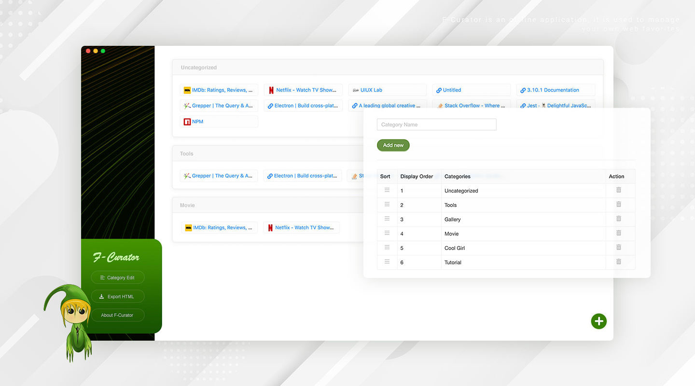

# F-Curator

<p align="center">
  <a href="https://github.com/xizon/f-curator">
	  
  </a>
  <p align="center">
	  <a href="https://www.npmjs.com/package/f-curator" title="npm version"></a>
	  <a href="https://github.com/xizon/f-curator/blob/master/LICENSE" title="license"></a>
	   
  </p>
  <br>
</p>


F-Curator is an offline application that comes at you all day long and curates your own web favorites. Based on Electron and React technology.

## Packages

[Package (macOS)](package/macOS/F-Curator.dmg)


## Getting Started

[https://youtu.be/VYdzttKU5H0](https://youtu.be/VYdzttKU5H0)





## Features

- **Offline** support and fast speeds
- Easily achieve **data persistence**
- Fetch **remote resources** to the local database
- **Category management** and clear list blocks
- Drag and drop **sorting**
- **Exporting HTML** that separates APP to use favorites
- Support quick search for URL and Site Name
- Judgment of URL validity and repetitiveness
- Automatically extract resources local, such as icons


## File Structures


```sh
/
├── README.md
├── LICENSE
├── tsconfig.json
├── babel.config.js
├── package-lock.json
├── package.json
├── package/      ·············· Available packages
├── db/           ·············· Local database
├── main/         ·············· Main Process Modules
├── renderer/     ·············· Renderer Process Modules
├── dist/
├── src/
├── test/  
├── public/  
│   └── index.html 
├── build/  
│   └── config.js
└──
```


## How To Use

To clone and run this repository. From your command line:

```sh
$ npm start
```


## APP Development Mode


You will need to have [node](https://nodejs.org/) setup on your machine. That will output the built distributables to `./dist/*` .

**Step 1.** Use NPM (Locate your current directory of project, and enter the following command.) or download the latest version from [Github](https://github.com/xizon/f-curator). For nodejs you have to install some dependencies.

```sh
$ sudo npm install f-curator
```

Or clone the repo to get all source files including build scripts: 

```sh
$ git clone git://github.com/xizon/f-curator.git
```


**Step 2.** First, using an absolute path into your `"f-curator/"` folder directory.

```sh
$ cd /{your_directory}/f-curator
```


**Step 3.** Before doing all dev stuff make sure you have `Node 10+` installed. After that, run the following code in the main directory to install the node module dependencies.

```sh
$ sudo npm install
```


**Step 4.** Commonly used commands:

Debug application. It can be checked separately as TypeScript without compiling and packaging behavior.

```sh
$ npm run check
```


**Step 5.** When you’re ready to deploy to production, create a minified bundle with:

```sh
$ npm run build
```


**Step 6.** When you have done, this will spin up a server that can be accessed at

```sh
http://localhost:8080
```


**Step 7.** Run the app in development mode

```sh
$ npm run dev
```

<blockquote>
<h3>💡 Note:</h3>
 
**If you upgrade the version of Node, please execute the following code:**

```sh
$ sudo npm install
$ sudo npm rebuild node-sass
```
</blockquote>


## Changelog


#### = 1.2.0 (January 18, 2022) =

* feat: Added the function of exporting HTML, separate APP to use favorites.
* fix: Optimized some styles.
* optimize: Modified dependencies and optimized app size.
* feat: Support quick search for URL and Site Name


#### = 1.0.1 (January 17, 2022) =

* Added command to compile package.

#### = 1.0.0 (January 3, 2022) =

* First release.


## Contributing

- [React](https://reactjs.org/)
- [Electron](https://www.electronjs.org/)
- [Ant Design](https://github.com/ant-design/ant-design/)
- [stormdb](https://github.com/TomPrograms/stormdb)
- [lodash](https://github.com/lodash/lodash)


## Supported development environment

- Electron 16 +
- React 17 +
- TypeScript 4.x.x + 
- Babel 7.x.x + 
- Webpack 5.x.x
- Jest 27.x.x


## Licensing

Licensed under the [MIT](https://opensource.org/licenses/MIT).


