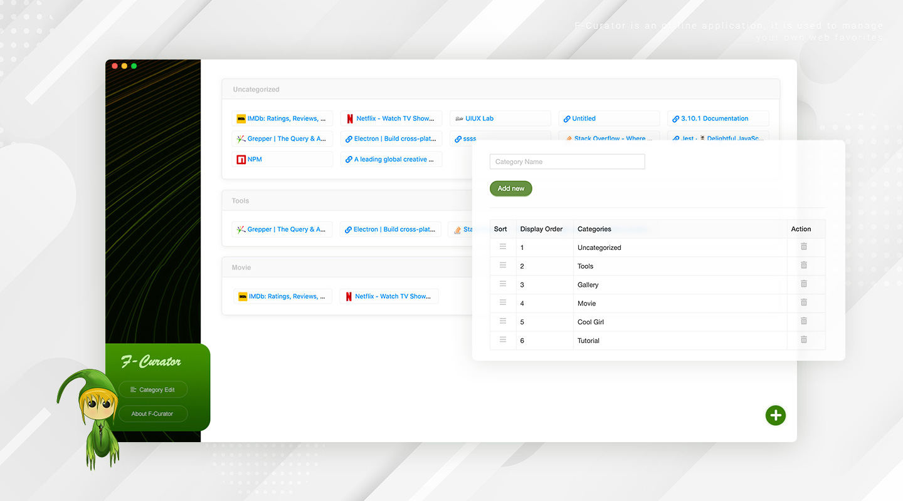

# F-Curator

<p align="center">
  <a href="https://github.com/xizon/f-curator">
	  
  </a>
  <p align="center">
	  <a href="https://www.npmjs.com/package/f-curator" title="npm version"></a>
	  <a href="https://github.com/xizon/f-curator/blob/master/LICENSE" title="license"></a>
	   
  </p>
  <br>
</p>


F-Curator 是一个跨平台应用程序，支持Mac和Windows系统，用来管理您自己的网络收藏夹，永久保存数据，解决用户的URL收藏需求。

无论您是需要为个人项目创建网址数据库，还是认为在制定专业计划时组织起来更容易管理，该程序都可以帮助您创建一个快速灵活的网站存储库，并允许用户创建多个类别，便于分类和访问。它避免了使用云的模式，保证数据的私有化。未来它可能还会有很多有趣而实用的私有化功能。


---

- [English](README.md)
- [中文](README_CN.md)

---

## 安装包


 [Mac](package/macOS/F-Curator.dmg) 

 [Windows](package/windows/F-Curator(win).zip)


## 向导

[官方网站](https://xizon.github.io/F-Curator-Official-Website/)

[视频演示](https://youtu.be/VYdzttKU5H0)





## 主要功能

- 离线支持和快速的响应速度
- 轻松实现数据持久化
- 获取远程资源到本地数据库
- 类别管理和列表块管理
- 简单的拖放排序
- 导出独立的HTML文件，可以脱离APP在任意操作系统中使用收藏夹
- 支持导入数据库包
- 支持快速搜索URL和站点名称
- URL有效性和重复性的判断
- 自动提取远程资源，例如图标


## 目录结构


```sh
/
├── README.md
├── LICENSE
├── tsconfig.json
├── babel.config.js
├── forge.config.js
├── package-lock.json
├── package.json
├── package/      ·············· 软件包
├── db/           ·············· 数据库
├── main/         ·············· 主进程
├── renderer/     ·············· 渲染进程
├── dist/
├── src/
├── test/  
├── scripts/  
├── public/  
│   └── index.html 
├── build/  
│   └── config.js
└──
```

## 更细日志

[releases](CHANGELOG.md)


## 感谢

- [React](https://reactjs.org/)
- [Electron](https://www.electronjs.org/)
- [Electron Forge](https://www.electronforge.io/)
- [Ant Design](https://github.com/ant-design/ant-design/)
- [stormdb](https://github.com/TomPrograms/stormdb)
- [lodash](https://github.com/lodash/lodash)


## 环境支持

- Electron 16 + / Electron 31 +
- React 18 +
- TypeScript 4.x.x + 
- Babel 7.x.x + 
- Webpack 5.x.x
- Jest 27.x.x


## 许可证

Licensed under the [MIT](https://opensource.org/licenses/MIT).


